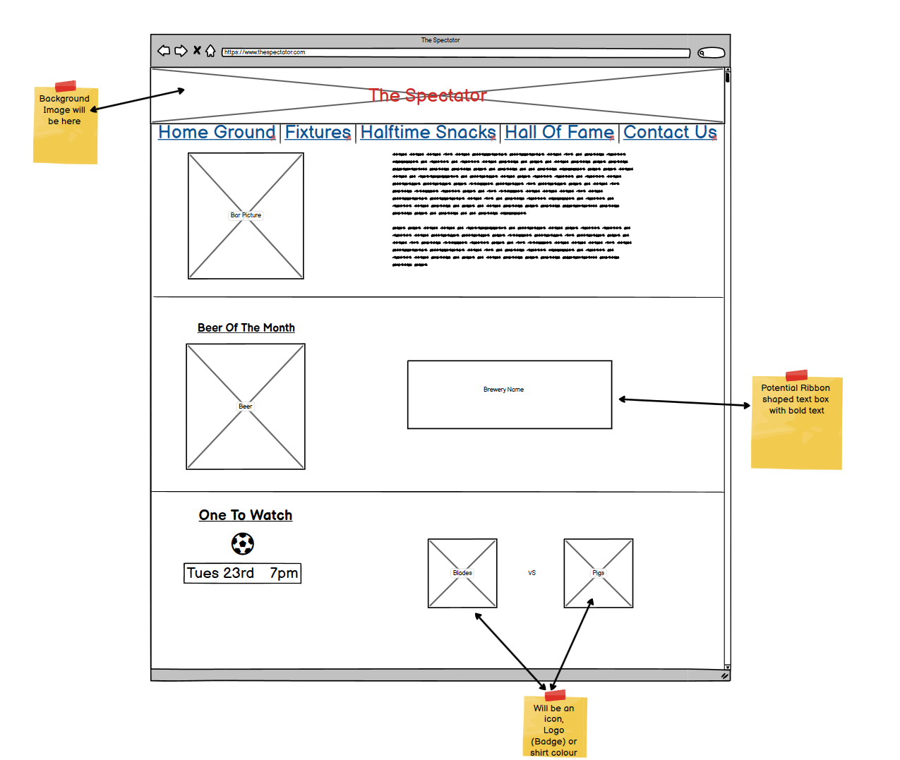
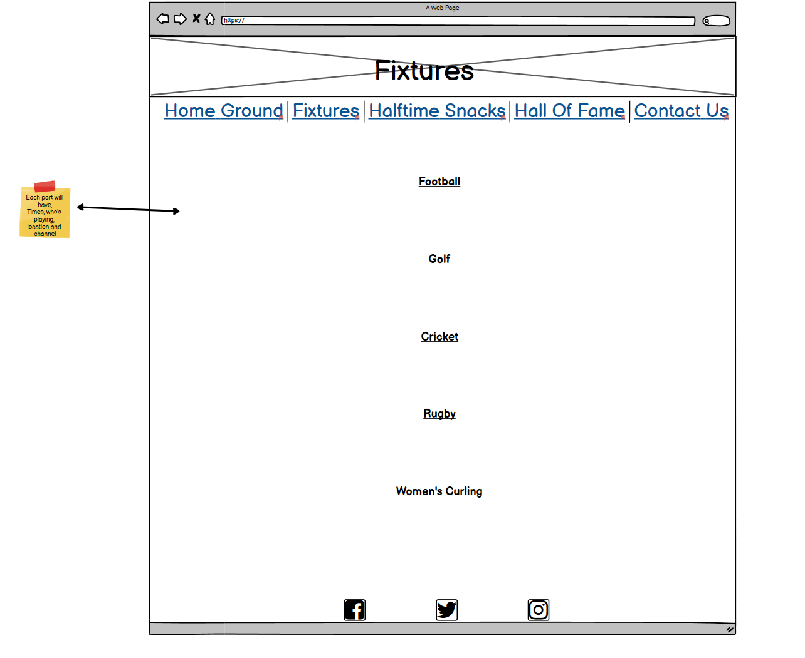
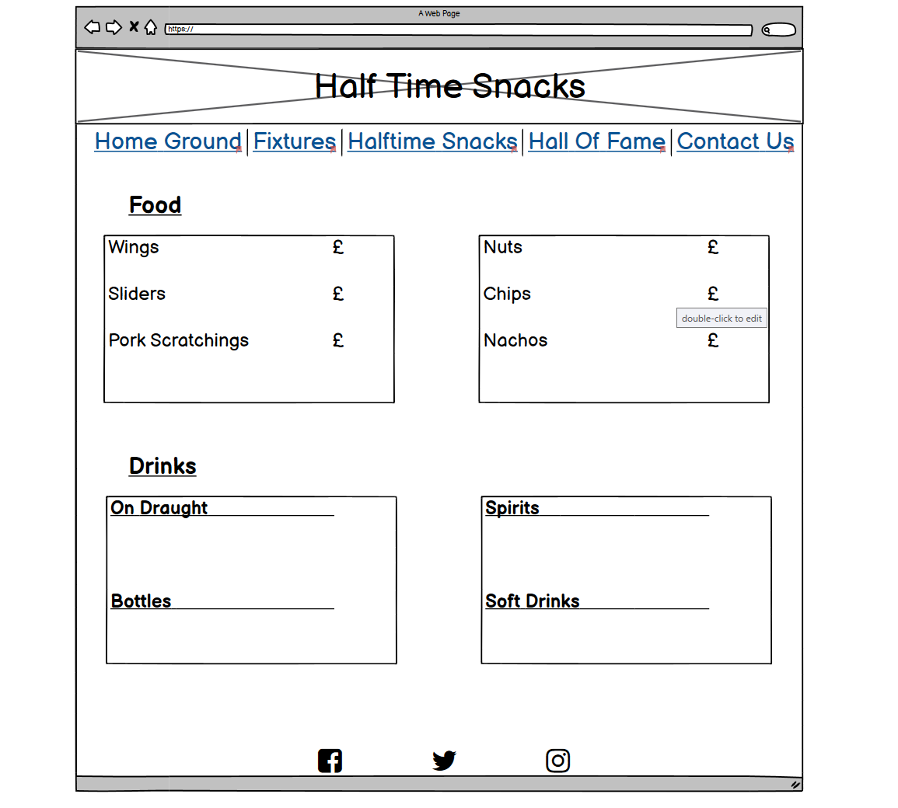
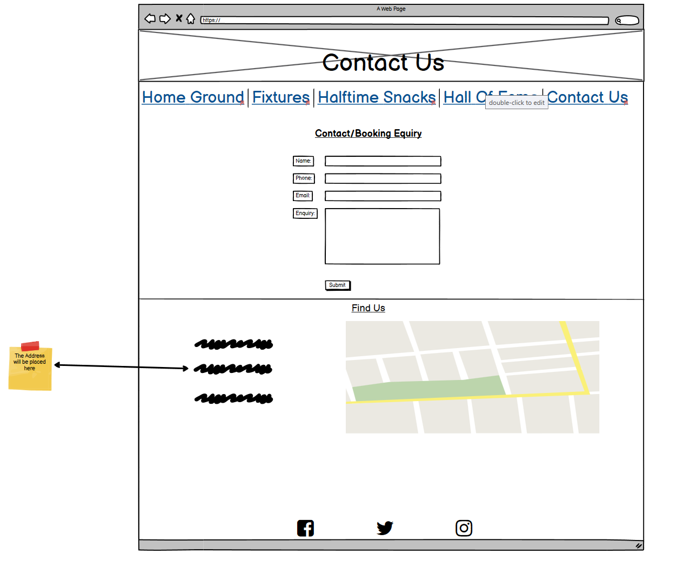
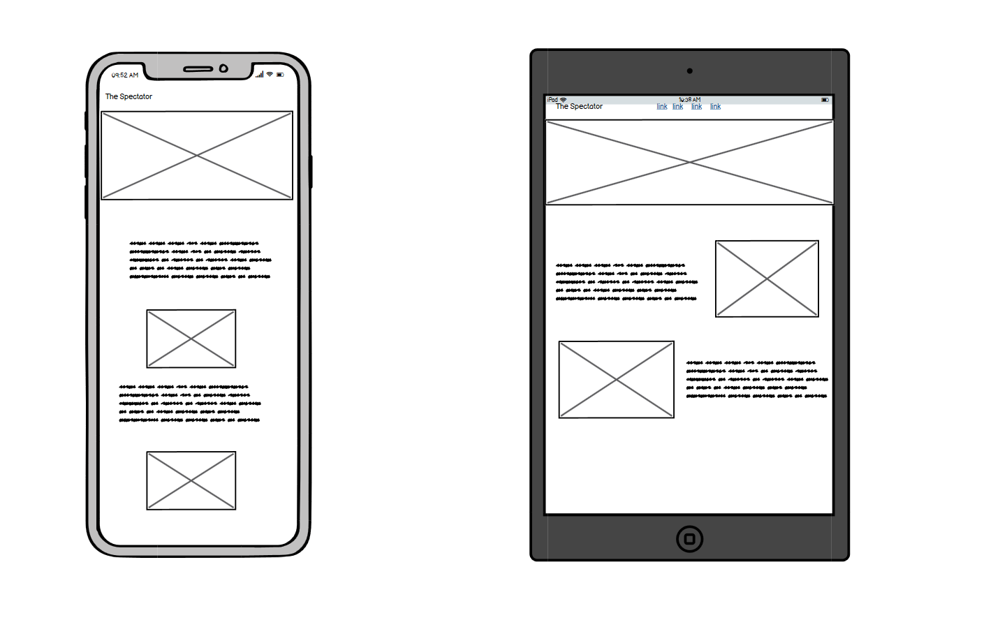
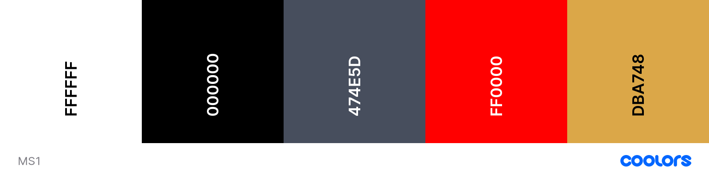

<h1 align=center>The Spectator</h1>

## About
- I chose to do a site purely like this because i got fed up of most sports bars been hard to navigate around. I simply wanted to design a site that was easy to navigate around and everything was easy to locate like finding what food & drink is available, what sports are showing and if i wanted to book a party/event then i could easy find it.

# Table of Contents 
* [UX](#UX)
    * [User Goals](#User-Goals)
    * [Target Audience](#Target-Audience)
    * [User Stories](#User-Stories)
    * [Wireframes](#wireframes)
    * [Surface](#surface)
* [Features](#Features)

* [Existing Features](#Existing-Features)
  * [Home Page](#Home-Page)
  * [Whats On](#Whats-On-Page)
  * [Food & Drink](#Food-&-Drink-Page)
  * [Contact-Us](#Contact-Us-Page)
             
* [Features to be Implemented in the Future](#Features-for-future-implementation)

* [Technologies Used](#Technologies-Used)

* [Testing](#Testing)

* [Credits](#Credits)
  * [Code](#Code)
  * [Text Content](#Text-Content)
  * [Media](#Media)
  * [Embedded Media](#Embedded-Media)
  * [Images and Icons](#Images-and-Icons)

* [Deployment](#Deployment)

* [Acknowledgements](#Acknowledgements)

 <h1>UX</h1>

 ### User Goals
 
* To be able to fully understand the objective of the site 
* Be able to navigate around the site easily 
* 
 
### Ux Stories

### First Time Visitor Goals

* As a new user, I want to understand what The Spectator is about 
* As a new user, I want the site to have clear navigation
* As a new user, I want to be able to tell new clients.
 

### Returning Visitor Goals

* As a returning user, i want to see updated events section
* As a returning user, i want to see updated food & drink section
* As a returning user, i want to see updated  beers of the month
* As a returning user, i want to see new offers and promotions.

## Wireframes

### Home Page 
 

### Whats On Page

### Food & Drink Page

### Contact Page

### Mobile View

## Surface

The main colors used in this project are

* Banner under main image Sunray: #DBA748
* Border around button on hero image Independance: #474E5D
* Social links banner Red and underline on hover : #FF000
* Footer strip Black: #000000

## Fonts
 
 The Fonts I installed are from [Google Fonts](https://fonts.google.com/)

 * <strong>Pacifico:</strong> Was used for the main bar logo and the headings for every page with a backup of sans-serif
 * <strong>Bebas Neue</strong>: Was used for all the text on the site with a backup of sans-serif  