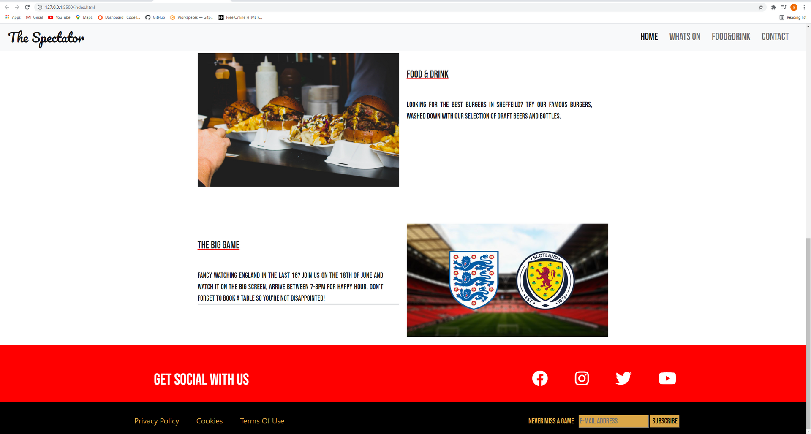

<h1 align=center>The Spectator</h1>

## About
- I chose to do a site purely like this because i got fed up of most sports bars been hard to navigate around. I simply wanted to design a site that was easy to navigate around and everything was easy to locate like finding what food & drink is available, what sports are showing and if i wanted to book a party/event then i could easy find it.

# Table of Contents 
* [UX](#UX)
    * [User Goals](#User-Goals)
    * [Target Audience](#Target-Audience)
    * [User Stories](#User-Stories)
    * [Wireframes](#wireframes)
    * [Design](#surface)

* [Features](#Features)

* [Existing Features](#Existing-Features)
  * [Home Page](#Home-Page)
  * [Whats On](#Whats-On-Page)
  * [Food & Drink](#Food-&-Drink-Page)
  * [Contact-Us](#Contact-Us-Page)
             
* [Features to be Implemented in the Future](#Features-for-future-implementation)

* [Technologies Used](#Technologies-Used)

* [Testing](#Testing)

* [Credits](#Credits)
  * [Code](#Code)
  * [Text Content](#Text-Content)
  * [Media](#Media)
  * [Embedded Media](#Embedded-Media)
  * [Images and Icons](#Images-and-Icons)

* [Deployment](#Deployment)

* [Acknowledgements](#Acknowledgements)

 <h1>UX</h1>

 ### User Goals
 
* To be able to fully understand the objective of the site 
* Be able to navigate around the site easily 
 
 
### Ux Stories

### First Time Visitor Goals

* As a new user, I want to understand what The Spectator is about 
* As a new user, I want the site to have clear navigation
* As a new user, I want to be able to tell new clients.
 

### Returning Visitor Goals

* As a returning user, i want to see updated events section
* As a returning user, i want to see updated food & drink section
* As a returning user, i want to see updated  beers of the month
* As a returning user, i want to see new offers and promotions.

## Wireframes

### Home Page 
 

### Whats On Page

### Food & Drink Page

### Contact Page

### Mobile View

## Design

### Colors

The main colors used in this project are

* Banner under main image Sunray: #DBA748
* Border around button on hero image Independance: #474E5D
* Social links banner Red and underline on hover : #FF000
* Footer strip Black: #000000

### Fonts
 
 The Fonts I installed are from [Google Fonts](https://fonts.google.com/)

 * <strong>Pacifico:</strong> Was used for the main bar logo and the headings for every page with a backup of sans-serif.
 * <strong>Bebas Neue</strong>: Was used for all the text on the site with a backup of sans-serif.  

### Icons

The icons i used were from font awesome [Font Awesome](https://fontawesome.com)

### Images 

All images were taken from:
[Unsplash](https://unsplash.com)
[Pexels](https://pexels.com)
[Shutterstock](https://www.shutterstock.com/)  (*signed up to a free trial*)

## Features

This is a 4 page website, with a main page, a whats on page, a fixtures and a contact page. 
all fully responsive 

### Existing Features 

 * <b>Header and navigation bar</b> 
   * Placed at the top left is the logo with is styled with the 'Pacifico' font. 
   * placed at the top right is the navigation menu styled in 'Bebas Neue'
   * The main header picture i chose to represent the atmosphere at The Spectator. 
   * The Contact button brings up a form for the user to enquire about an event.

 
* <b>Food and Drink</b>
  * The food and Drink section provides the user to look at whats available at the spectator
  * Both button take the user to a menu for food and drink, which opens up in to a pdf file.

 

* <b>Whats On Page</b>
  * Lets the user look at whats games are on that week.
  * Tried to kep this page basic, dont want to confuse the user with too much innformation.

* <b>Contact Section</b>
  * Just a simple contact form lets the user select what they want to ask ie book table or hire venue

* <b>Footer</b>
  * The footer contains all the social links to find The Spectator on clicking them opens a new tab and take the user to the site.
  * I also added the "never miss a game" which allows the user to input there email address and will recieve all upcomming events.

