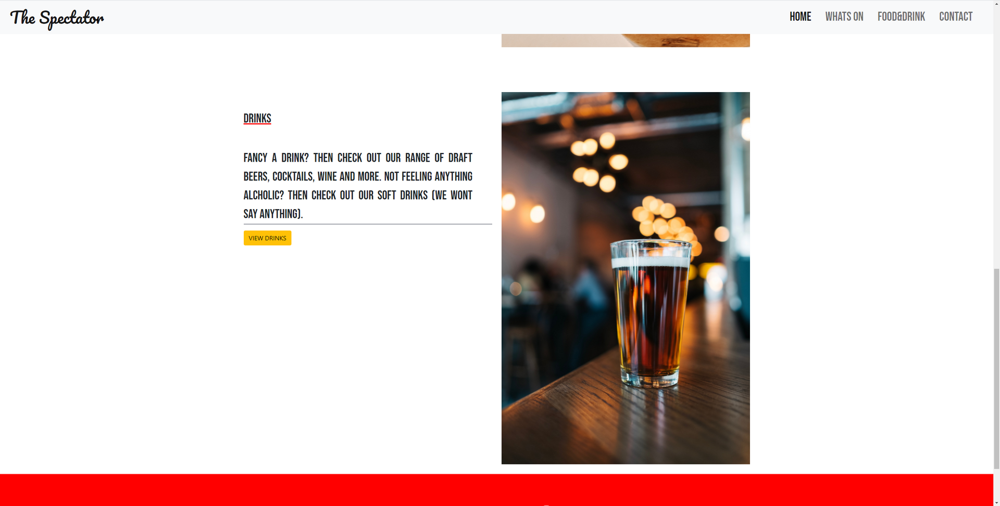

<h1 align=center>The Spectator</h1>

## About
- I chose to do a site purely like this because i got fed up of most sports bars been hard to navigate around. I simply wanted to design a site that was easy to navigate around and everything was easy to locate like finding what food & drink is available, what sports are showing and if i wanted to book a party/event then i could easy find it.

# Table of Contents 
* [UX](#UX)
    * [User Goals](#User-Goals)
    * [Target Audience](#Target-Audience)
    * [User Stories](#User-Stories)
    * [Wireframes](#wireframes)
    * [Design](#surface)

* [Features](#Features)

* [Existing Features](#Existing-Features)
  * [Home Page](#Home-Page)
  * [Whats On](#Whats-On-Page)
  * [Food & Drink](#Food-&-Drink-Page)
  * [Contact-Us](#Contact-Us-Page)
             
* [Features to be Implemented in the Future](#Features-for-future-implementation)

* [Technologies Used](#Technologies-Used)

* [Testing](#Testing)

* [Credits](#Credits)
  * [Code](#Code)
  * [Text Content](#Text-Content)
  * [Images and Icons](#Images-and-Icons)

* [Deployment](#Deployment)

* [Acknowledgements](#Acknowledgements)

 <h1>UX</h1>

 ### User Goals
 
* To be able to fully understand the objective of the site. 
* Be able to navigate around the site easily.
* Want to be immediately drawn in to the site.
 
 
### Ux Stories

### First Time Visitor Goals

* As a new user, I want to understand what The Spectator is about 
* As a new user, I want the site to have clear navigation
* As a new user, I want to be able to tell new clients.
* As a new user, I want a clear contact section.
 

### Returning Visitor Goals

* As a returning user, i want to see updated events section
* As a returning user, i want to see updated food & drink section
* As a returning user, i want to see new offers and promotions.

## Wireframes

### Home Page 
 

### Whats On Page

### Food & Drink Page

### Contact Page

### Mobile View

## Design

### Colors

The main colors used in this project are

* Banner under main image Sunray: #DBA748
* Border around button on hero image Independance: #474E5D
* Social links banner Red and underline on hover : #FF000
* Footer strip Black: #000000

### Fonts
 
 The Fonts I installed are from [Google Fonts](https://fonts.google.com/)

 * <strong>Pacifico:</strong> Was used for the main bar logo and the headings for every page with a backup of sans-serif.
 * <strong>Bebas Neue</strong>: Was used for all the text on the site with a backup of sans-serif.  

### Icons

The icons i used were from font awesome [Font Awesome](https://fontawesome.com)

### Images 

All images were taken from:
[Unsplash](https://unsplash.com)
[Pexels](https://pexels.com)
[Shutterstock](https://www.shutterstock.com/)  (*signed up to a free trial*)

## Features

This is a 4 page website, with a main page, a whats on page, a fixtures and a contact page. 
all fully responsive 

### Existing Features 

 * <b>Header and navigation bar</b> 
   * Placed at the top left is the logo with is styled with the 'Pacifico' font. 
   * placed at the top right is the navigation menu styled in 'Bebas Neue'
   * The main header picture i chose to represent the atmosphere at The Spectator. 
   * The Contact button brings up a form for the user to enquire about an event.

 

* <b>Food and Drink</b>
  * The food and Drink section provides the user to look at whats available at the spectator
  * Both button take the user to a menu for food and drink, which opens up in to a pdf file.

 

* <b>Whats On Page</b>
  * Lets the user look at whats games are on that week.
  * Tried to kep this page basic, dont want to confuse the user with too much innformation.

 

* <b>Contact Section</b>
  * Just a simple contact form lets the user select what they want to ask ie book table or hire venue

 

* <b>Footer</b>
  * The footer contains all the social links to find The Spectator on clicking them opens a new tab and take the user to the site.
  * I also added the "never miss a game" which allows the user to input there email address and will recieve all upcomming events.

### Features to be implemented in the future
  * The site would be great with an online booking portal.
  * The site would also benifit from a video tour as soon as you access the site.
  * The site would also do well with a reviiew section.

  

  ## Technologies Used

  ### Languages
    
  * HTML 
  * CSS
  * Java Script

  ### Frameworks & Tools

  * GitHub
  * Visual Studio
  * Google Fonts
  * Font Awesome
  * W3C Validator
  * W3C CSS Validator (Jigsaw)#
  * Am I Responsive
  * Crome Developer Tools
  * Firefox Developer tools 
  * Bootstrap 5
  * Balsamiq 
  * Coolors

  

  ## Testing

  ### Approach 

  I tested the site regularly during the development process, by previewing it in the live server window and inspecting with Google Chrome DevTools at various breakpoints. Simultaneously, I was checking any new additions and changes on several devices available in my household. Any issues found, were addressed at that stage and double checked before moving on with the rest of the project.

Only later in the project, I started using FireFox DevTools found it much easier to play around with styling changes before implementing them into my actual code which could have saved me time and multiple commits for the same element.

In the final stage of the project, I have tested the site thoroughly with automatic validators and manually on different devices and in several browsers, taking into account user stories from the UX section, as per below.

### User stories testing from the UX section

* **First Time Visitor Goals**

  * As a new user, I want to understand what The Spectator is about. 

  * **Result:** PASS

  * The Hero image shows exactly what the The Spectator is about a warm welcoming place where friend can meet and have a drink a watch whatever sport is on. 
  

  * Be able to navigate around the site easily.
   
   * **Result:** PASS

   The site has a very simple navigation bar which links directly to a new tab.
   and a dropdown menu in mobile version.
  
   
   

   *   As a new user, I want to be able to tell new clients.

    * **Result:** PASS

    The site have got clear social links just above the footer which directs the user to that destination.

    

    * As a new user, I want a clear contact section.

     * **Result:** PASS

     The contact form is very minimalistic every is clear and easy for the user to understand. 

     
     The mobile version of the contact form.
     

      

* **Returning Customers**
     
   * As a returning user, i want to see updated events section.
     
      **Result:** PASS

      In the whats on section, there is always a weekly view on the events coming up and will be updated daily.
      
   * As a returning user, i want to see updated food & drink section.

     **Result:** PASS

     The food and drink section has an up to date menu, 
      

   * As a returning user, i want to see new offers and promotions.
     
     **Result:** PASS

     By the user joining the newsletter they will be able to keep up with current and future offer and promotions been released.

 ## Validator Testing
 

 Here are the results for HTML

 

 Here are my results for css.
 

### Lighthouse

I generated desktop and mobile Lighthouse reports from Google Chrome DevTools to review performance, SEO, the best practices and accessibility of the site. Mobile showed better results but desktop could be alot better.

## Credits

### Code

The Code Institute materials with the support of tutorial materials on w3schools, MDN Web Docs and bootstrap were used to create this site. All code seen in use there has been heavily modified to suit the needs of this site, except for the specific cases referenced below.

Reference materials from w3schools and css-tricks were used to implement flexbox.

Button  code was taken from Bootstrap docs.

Icons taken from Font Awesome.

### Text Content

All text was written by me, but used sites https://champsbar.co.uk and https://www.belushis.com for inspiration.

### Images 

Images were sourced from Unsplash, Pexels and Shutterstock. Thank you to all the photographers!

#### Header Images
Index Image is from shutterstock by - Monkey Buisness Images
Whats on Image is from shutterstock by - Monkey Buisness Images
Food Image is from unsplash by - Elevate
Contact Image is from Unsplash by - Adam Solomon

#### Other Images
About us picture is from Pexels - by Elevate
Food Image is from Unsplash by - call me hangry
England Image is taken from google images 
Burger Image is from Unsplash by - Paul Kapishka
Drink Image is from Unsplash by - Jonas Jackson

## Deployment

This project was developed using the Gitpod IDE. In order to save and see what I worked with previously I always add commit messenges and then Git push to save and push it to Github.

For deploy this site I had to follow this steps:

* Log in to my account at Github.
* Open the repository that I wanted to deploy.
* Select settings in the menu at the top and scroll down to Pages.
* Open the drop-down menu in the source section.
* Select main instead of none.
* Save and wait a few seconds until it deployed.

Here is my live link deployed: https://sam-foster.github.io/Project/

## Acknowledgements

I would like to thank my partner, she has been amazing and supportive through all of my first project. I would also like to thank my mentor Marcel Mulders, for pointing me in the right direction. Last but not least my tutor at Harlow college Patrick Justus for our 1 to 1 sessions on a Thursday, these have been really helpful.

The Slack Community has been brilliant, any questions asked they've been really quick to answer them if they can.

## Disclaimer

The Spectator is an imaginary sports bar and the content of this website is for educational purposes only. It was created for the Code Institute’s HTML and CSS Essentials Portfolio Project, as part of their Diploma in Full Stack Software Development. The requirements are to make a static front-end website, using HTML and CSS.